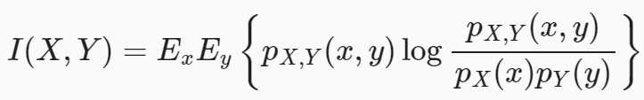
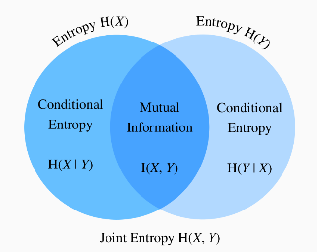

Key assumption: $x_0|y$ and $x_0^{'}|y$ are independent, i.e. $p(x_0,x_0^{'}|c)=p(x_0|c)p(x_0^{'}|c)$

How can we sample $(x_0,x_0^{'})$ ? First, draw $c \sim p(c)$, then draw $x_0, x_0^{'} i.i.d \sim p(x|c)$

$$
\begin{align}
k_t(x_t,x_t^{'})
&=\frac{p(x_t,x_t^{'})}{p(x_t)p(x_t^{'})}\\
&=\frac{\int_cp(x_t|c)p(x_t^{'}|c)p(c)dc}{p(x_t)p(x_t^{'})} \\
&=\frac{E_{p(c)}[p(x_t|c)p(x_t^{'}|c)]}{p(x_t)p(x_t^{'})} (Remark:E_{p(c)}f(c)=\int_c{}f(c)p(c)dc)\\
&=\frac{E_{p(c)}[\int_{x_0}\int_{x_0^{'}}p(x_0|c)p(x_0^{'}|c)p(x_t|x_0)p(x_t^{'}|x_0^{'})dx_0dx_0^{'}]}{\int_{x_0}\int_{x_0^{'}}p(x_t|x_0)p(x_t^{'}|x_0^{'})p(x_0)p(x_0^{'})dx_0dx_0^{'}}(Remark:p(x_t|x_0,c):=p(x_t|x_0))\\
&=\frac{\int_{x_0}\int_{x_0^{'}}p(x_t|x_0)p(x_t^{'}|x_0^{'})p(x_0,x_0^{'})dx_0dx_0^{'}}{\int_{x_0}\int_{x_0^{'}}p(x_t|x_0)p(x_t^{'}|x_0^{'})p(x_0)p(x_0^{'})dx_0dx_0^{'}} \\
&= \frac{E_{p(x_0,x_0^{'})}[p(x_t|x_0)p(x_t^{'}|x_0^{'})]}{E_{p(x_0)}p(x_t|x_0)E_{p(x_0^{'})}p(x_t|x_0^{'})}\\
&= MC \, estimation \quad E_{p(x)}f(x) \approx \frac{1}{n}\sum_{i=1}^n f(x_i), sample \,  x_i \, from \, p(x)
\end{align}

$$

By sampling,

We can also use the kernel from the view of information theory.

Given the previous setting of random variables (X,Y), you may wonder: “Now that we know how much information is contained in X but not in Y, can we similarly ask how much information is shared between X and Y?”

X,Y若有关系，则互信息较大；不相关，则互信息为0。

We can calculate the mutual information by trained_NN.
