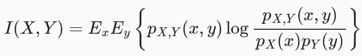
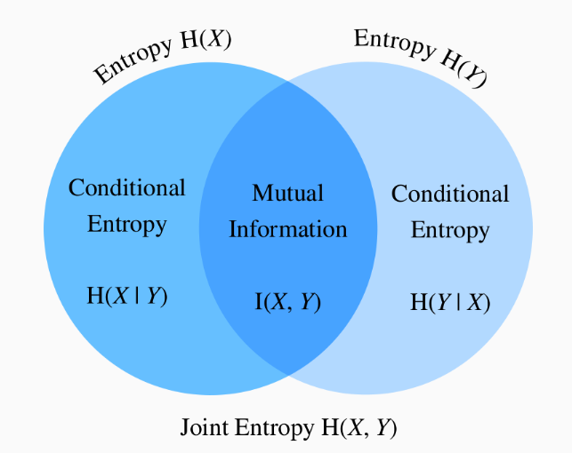

#### Goal: 
Train NN to learn eigenfunctions of diffusion kernel, the trained kernel can be used in downstream tasks and the output(eigenfunctions) can be good data representation.

#### Methods:
Define a time-dependent diffusion kernel
$$
k_t\left(\boldsymbol{x}_t, \boldsymbol{x}_t^{\prime}\right):=\frac{p_t\left(\boldsymbol{x}_t, \boldsymbol{x}_t^{\prime}\right)}{p_t\left(\boldsymbol{x}_t\right) p_t\left(\boldsymbol{x}_t^{\prime}\right)}
$$

From previous work of Zhijie Deng, we know how to train the eigenfunctions of this kernel:

Then the key problem turns to how to sample from $p(x_t,x_t^{'})$.
Key assumption: $x_0|y$ and $x_0^{'}|y$ are independent, i.e. $p(x_0,x_0^{'}|c)=p(x_0|c)p(x_0^{'}|c)$

How can we sample from $p(x_0,x_0^{'})$ ? First, draw $c \sim p(c)$, then draw $x_0, x_0^{'} i.i.d \sim p(x|c)$

$$
\begin{aligned}
k_t(x_t,x_t^{'})
&=\frac{p(x_t,x_t^{'})}{p(x_t)p(x_t^{'})} \\
&=\frac{\int_cp(x_t|c)p(x_t^{'}|c)p(c)dc}{p(x_t)p(x_t^{'})} \\
&=\frac{E_{p(c)}[p(x_t|c)p(x_t^{'}|c)]}{p(x_t)p(x_t^{'})} (Remark:E_{p(c)}f(c)=\int_c{}f(c)p(c)dc)\\
&=\frac{E_{p(c)}[\int_{x_0}\int_{x_0^{'}}p(x_0|c)p(x_0^{'}|c)p(x_t|x_0)p(x_t^{'}|x_0^{'})dx_0dx_0^{'}]}{\int_{x_0}\int_{x_0^{'}}p(x_t|x_0)p(x_t^{'}|x_0^{'})p(x_0)p(x_0^{'})dx_0dx_0^{'}}(Remark:p(x_t|x_0,c):=p(x_t|x_0))\\
&=\frac{\int_{x_0}\int_{x_0^{'}}p(x_t|x_0)p(x_t^{'}|x_0^{'})p(x_0,x_0^{'})dx_0dx_0^{'}}{\int_{x_0}\int_{x_0^{'}}p(x_t|x_0)p(x_t^{'}|x_0^{'})p(x_0)p(x_0^{'})dx_0dx_0^{'}} \\
&= \frac{E_{p(x_0,x_0^{'})}[p(x_t|x_0)p(x_t^{'}|x_0^{'})]}{E_{p(x_0)}p(x_t|x_0)E_{p(x_0^{'})}p(x_t|x_0^{'})}\\
&= \frac{E_{p(x_0,x_0^{'})}[p(x_t|x_0)p(x_t^{'}|x_0^{'})]}{p(x_t)p(x_t^{'})}\\
&\approx MC \, estimation \quad E_{p(x)}f(x) \approx \frac{1}{n}\sum_{i=1}^n f(x_i), sample \,  x_i \, from \, p(x) 
\end{aligned}
$$

From above, we can know sample from $p(x_t,x_t^{'})$. First, draw $c \sim p(c)$, then draw $x_0, x_0^{'} i.i.d \sim p(x|c)$ and add noise.
#### Evaluating metrics:
1. Use eigenfunction as representation to train classifier.
2. According to Mercer’s theorem:
   $$\kappa\left(\boldsymbol{x}, \boldsymbol{x}^{\prime}\right)=\sum_{j \geq 1} \mu_j \psi_j(\boldsymbol{x}) \psi_j\left(\boldsymbol{x}^{\prime}\right)$$
   So we can use it to generate new paired samples:
   $\begin{aligned} \nabla_{\boldsymbol{x}_t} \log p_t\left(\boldsymbol{x}_t, \boldsymbol{x}_t^{\prime}\right) & =\nabla_{\boldsymbol{x}_t} \log p_t\left(\boldsymbol{x}_t\right)+\nabla_{\boldsymbol{x}_t} \log k_t\left(\boldsymbol{x}_t, \boldsymbol{x}_t^{\prime}\right) \\ \nabla_{\boldsymbol{x}_t^{\prime}} \log p_t\left(\boldsymbol{x}_t, \boldsymbol{x}_t^{\prime}\right) & =\nabla_{\boldsymbol{x}_t^{\prime}} \log p_t\left(\boldsymbol{x}_t^{\prime}\right)+\nabla_{\boldsymbol{x}_t^{\prime}} \log k_t\left(\boldsymbol{x}_t, \boldsymbol{x}_t^{\prime}\right)\end{aligned}$
3. We can also use the kernel from the view of information theory.

Given the previous setting of random variables (X,Y), you may wonder: “Now that we know how much information is contained in X but not in Y, can we similarly ask how much information is shared between X and Y?”

X,Y若有关系，则互信息较大；不相关，则互信息为0。

We can calculate the mutual information by trained_NN.
